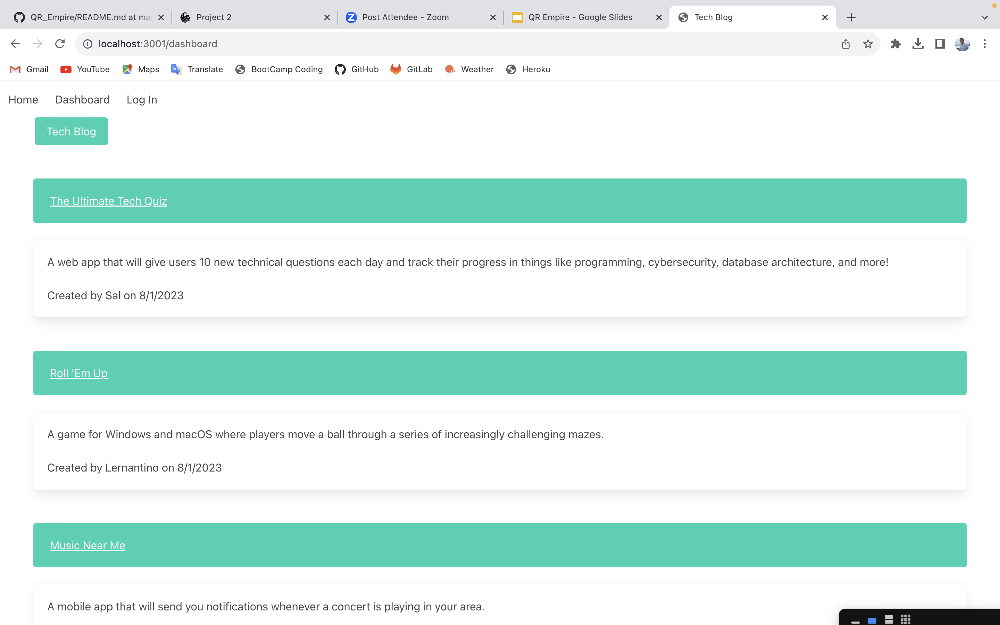

# Tech Blog     

## Description

- What was your motivation?
    
    Take the user to a Blog site. The user can sign or login their account to view posts from other users. They also can create a post , edit their post, and add comment to other user's post.

- Why did you build this project? (Note: the answer is not "Because it was a homework assignment.")
    
    For weekly assignment

- What did you learn?
    
    learn more a full-stack

## Table of Contents:

- [Installation](#installation)
- [Usage](#usage)
- [License](#license)
- [Contributing](#how-to-contribute)
- [Test](#tests)
- [Questions](#questions)

## Installation

    Creat a repo on GitHub and clone it to local computer. Coding for Shape.js, text.js, and index.js. Run the indexsx.js to create a svg file by tthe command line is node index.js

## Usage

## License

The last section of a high-quality README file is the license. This lets other developers know what they can and cannot do with your project. If you need help choosing a license, refer to [https://choosealicense.com/](https://choosealicense.com/).

[MIT License](https://choosealicense.com/licenses/mit/)
    
    A short and simple permissive license with conditions only requiring preservation of copyright and license notices. Licensed works, modifications, and larger works may be distributed under different terms and without source code.    

## Contributing
    Tried to work more class and function

## Tests
    run node index.js to test the result

## Questions

- My GitHub: [nquanbao](https://github.com/nquanbao)

- If you have any question or need to report any issues about the application, please contact me by e-mail.

- My e-mail address : [nqbaocmc@gmail.com](nqbaocmc@gmail.com)
